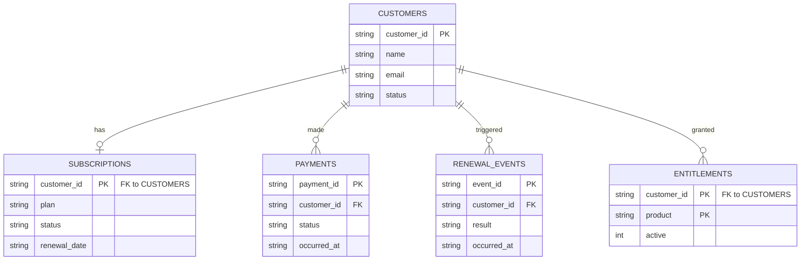

# Subscription Renewal Support Agent

A prototype support-diagnosis tool for subscription renewal failures.
Given a customer ID, it produces a diagnosis, the evidence behind it,
and (optionally) a plain-English explanation for a support agent.

## Design principle: rules decide, the model explains

The diagnosis is never made by an LLM. A set of deterministic SQL
checks reads payment, subscription, renewal, and entitlement records,
and a plain rule-based classifier turns that evidence into a diagnosis
code. This means every diagnosis is reproducible and testable with no
model involved at all.

The LLM's only job is to turn an already-decided diagnosis and its
evidence into readable prose for a human. It has no database handle —
enforced by [tests/test_explain.py](tests/test_explain.py), which
fails if `app/explain.py` ever imports `app.db` or `sqlite3`.

A third, separate layer — [app/hints.py](app/hints.py) — answers a
different question for a different audience. The diagnosis code says
*what's* wrong, for a support agent or customer; investigation hints
say *where to look*, for an engineer, using finer-grained evidence the
diagnosis code alone discards (e.g. an entitlement record that's
missing entirely vs. one that exists but is inactive — same diagnosis
code, different root cause). This layer is rule-based too, for the
same reason the diagnosis is: reproducible, testable, no model
involved.

```
HTTP request → FastAPI → SQL evidence checks → rule-based classifier → diagnosis code
                                                                              │
                                                     ├──────────► investigation hints (for engineers)
                                                     │
                                                     └─► (optional) LLM explainer → prose (for the customer)
```

## Data model

Five tables, each representing a different subsystem's own record of
what happened. A diagnosis is really about detecting where two of
these disagree with each other.



## What it diagnoses

| Diagnosis code             | Meaning                                                |
|-----------------------------|---------------------------------------------------------|
| `OK`                        | Renewal succeeded, nothing wrong                        |
| `PAYMENT_DECLINED`          | Latest payment attempt was declined                     |
| `RENEWAL_EVENT_MISSING`     | Payment succeeded but no renewal event was ever recorded|
| `RENEWAL_EVENT_FAILED`      | A renewal event exists and recorded failure             |
| `RENEWED_AFTER_CANCELLATION`| Renewal fired despite the subscription being canceled   |
| `ENTITLEMENT_NOT_ACTIVATED` | Renewal succeeded but entitlement never went active      |
| `NO_SUBSCRIPTION`           | No subscription record for this customer                |

## Running it

```bash
pip install -r requirements.txt
pytest -v                        # tests only, no external services required

uvicorn app.main:app --reload
# then open http://127.0.0.1:8000/docs
```

`GET /customers` lists the seeded demo customers (customer ID + name).
`GET /diagnose/{customer_id}` runs the deterministic path only and
also returns `investigation_hints`.
`GET /diagnose/{customer_id}/explain` also calls Claude and requires
`ANTHROPIC_API_KEY` to be set.
`GET /ui/` serves a small demo page: pick a customer, click Diagnose
(or Diagnose + Explain), see the result rendered live.

Seeded demo customers — customer IDs are arbitrary and don't hint
at what's wrong; the failure lives in the underlying records, not the ID:

| Customer ID | Name          | Demonstrates                             |
|-------------|---------------|-------------------------------------------|
| `ACC-10234` | Sam Taylor    | `OK`                                       |
| `ACC-10391` | Jordan Lee    | `PAYMENT_DECLINED`                         |
| `ACC-10528` | Riley Chen    | `RENEWED_AFTER_CANCELLATION`               |
| `ACC-10662` | Morgan Patel  | `RENEWAL_EVENT_MISSING`                    |
| `ACC-10809` | Casey Nguyen  | `ENTITLEMENT_NOT_ACTIVATED` (record inactive) |
| `ACC-10945` | Avery Brooks  | `ENTITLEMENT_NOT_ACTIVATED` (record missing)  |

## What this is (and isn't)

This is a working prototype demonstrating an architecture decision,
built test-first with CI enforcing correctness on every commit — not
a production system. Data is in-memory SQLite reseeded per call; there
is no persistence, auth, or deployment target yet.

## CI

Every push runs the full test suite via GitHub Actions
([.github/workflows/ci.yml](.github/workflows/ci.yml)). Check the
[Actions tab](../../actions) for history.
